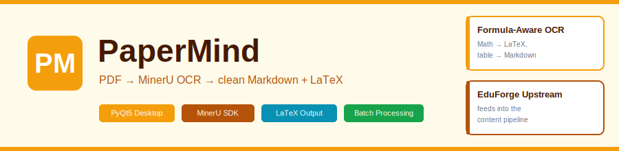
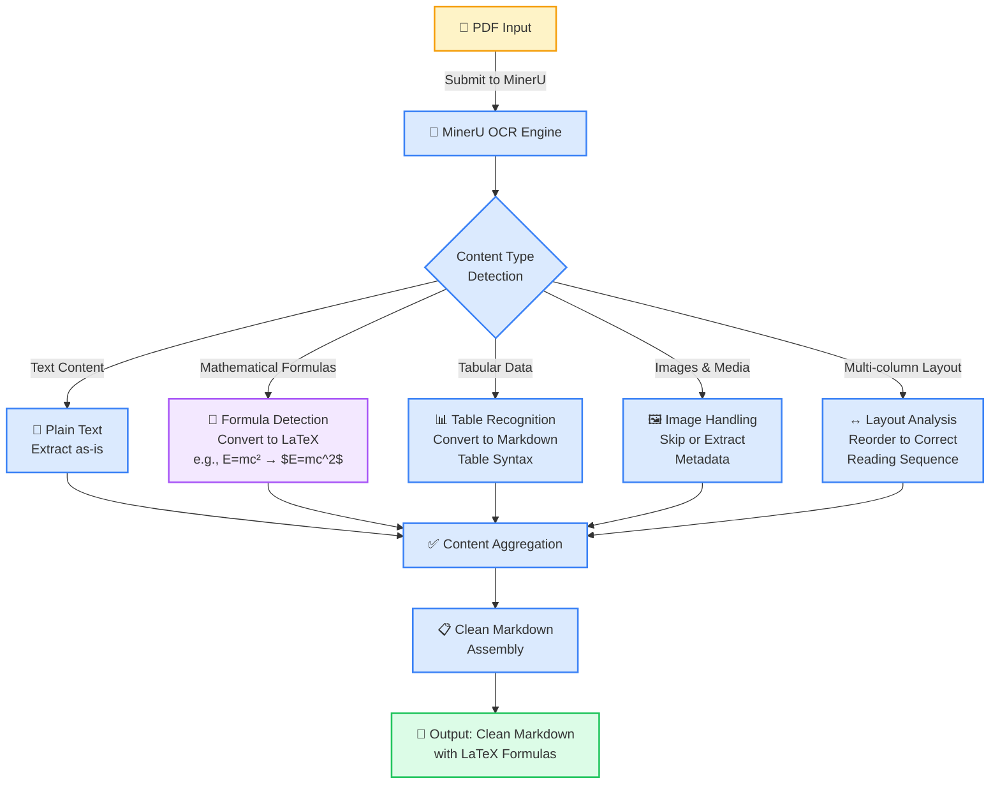
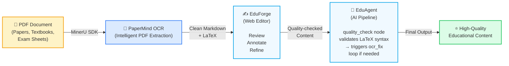
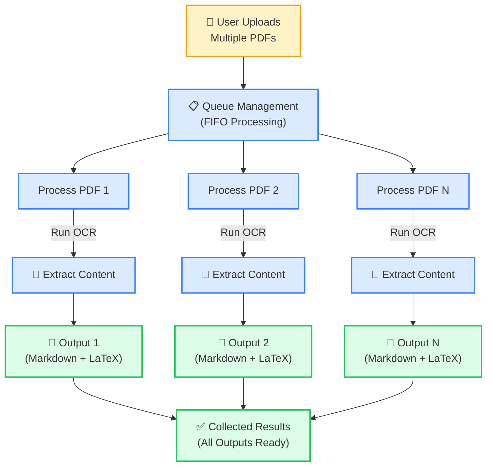

<p align="center">
  
</p>

<h1 align="center">PaperMind</h1>

<p align="center"><em>Intelligent PDF OCR client powered by MinerU</em></p>

<p align="center">
  
  
  
  
</p>

<p align="center">
  <a href="#what-it-does">What It Does</a> •
  <a href="#features">Features</a> •
  <a href="#quick-start">Quick Start</a> •
  <a href="#output-format">Output Format</a> •
  <a href="#中文说明">中文说明</a> •
  <a href="#license">License</a>
</p>

---

## What It Does

PaperMind converts PDF documents (academic papers, exam sheets, textbooks) into clean, structured text using the **MinerU OCR SDK**. Unlike basic OCR tools that struggle with complex layouts, PaperMind handles:

- **Mathematical formulas** → LaTeX output (`$\frac{1}{2}$`)
- **Tables** → structured Markdown tables
- **Multi-column layouts** → correct reading order
- **Mixed content** (text + images + formulas) → clean, editable Markdown

---

## Features

| Feature | Detail |
|---------|--------|
| **MinerU Integration** | High-accuracy document analysis with formula and table recognition |
| **LaTeX Output** | Mathematical formulas converted to LaTeX format for downstream LLM processing |
| **Batch Processing** | Queue multiple PDFs for sequential processing |
| **Layout Preservation** | Maintains original document structure including hierarchy and spacing |
| **PyQt5 Desktop UI** | User-friendly interface with drag-and-drop support, no CLI required |
| **Markdown Export** | Results saved as clean, editable Markdown files |

---

## Quick Start

### Installation

```bash
git clone https://github.com/HongdiHe/papermind.git
cd papermind

pip install -r requirements.txt
```

### Running PaperMind

```bash
python main.py
```

The PyQt5 desktop application will launch. Simply drag and drop your PDF files, and PaperMind will process them using MinerU's OCR engine.

---

## Output Format

### Before vs. After

**Input:** PDF with mixed content
- Text paragraphs
- Mathematical equations: `f(x) = x² + 2x + 1`
- Tables with headers and data
- Multi-column text layout

**Output:** Clean Markdown with LaTeX

```markdown
# Document Title

This is extracted text with proper structure.

## Mathematical Content

The quadratic formula is given by:

$$x = \frac{-b \pm \sqrt{b^2 - 4ac}}{2a}$$

## Table Example

| Column A | Column B | Column C |
|----------|----------|----------|
| Data 1   | Data 2   | Data 3   |
| Data 4   | Data 5   | Data 6   |

## Multi-column Layout

Text that was in multiple columns is now properly ordered...
```

---

## OCR Processing Pipeline

The following diagram shows the detailed workflow of how PaperMind processes a PDF using MinerU's OCR engine:



---

## Role in the System

PaperMind is the OCR frontend for the educational content processing pipeline:



**Why LaTeX matters:** [EduAgent](https://github.com/HongdiHe/edu-agent) uses the LaTeX-formatted output in its quality check pipeline. Malformed formulas would trigger unnecessary correction loops, so precision in OCR is critical.

---

## Batch Processing Queue

PaperMind supports efficient batch processing of multiple PDF documents:



---

## Project Structure

```
papermind/
├── main.py                      # Application entry point
├── src/
│   ├── models/                  # Data structures and models
│   ├── services/
│   │   ├── mineru_api.py       # MinerU OCR API integration
│   │   └── llm_api.py          # LLM service integration (optional)
│   ├── ui/                      # PyQt5 user interface
│   │   ├── main_window.py      # Main application window
│   │   ├── upload_view.py      # File upload interface
│   │   ├── ocr_view.py         # OCR processing view
│   │   └── result_view.py      # Results display
│   └── utils/                   # Utilities
│       ├── config_loader.py    # Configuration management
│       ├── logger.py           # Logging setup
│       └── markdown_renderer.py # Markdown rendering
├── requirements.txt             # Python dependencies
└── README.md                    # This file
```

---

## Configuration

PaperMind uses environment variables and configuration files for setup:

```yaml
# .env or config.yaml
mineru.api_key: YOUR_API_KEY_HERE
mineru.model_version: vlm  # Vision-Language Model version
mineru.timeout: 300        # Request timeout in seconds
mineru.poll_interval: 5    # Polling interval in seconds
```

Obtain your MinerU API key from [mineru.net](https://mineru.net).

---

## Requirements

- Python 3.8+
- PyQt5 (desktop UI)
- MinerU SDK (OCR engine)
- Markdown processor
- Image processing libraries

See `requirements.txt` for full dependency list.

---

---

<h2 align="center" id="中文说明">中文说明</h2>

<p align="center"><em>PaperMind — 基于 MinerU 的 PDF 智能提取桌面工具</em></p>

### 项目背景

学术论文、试卷和教材中大量存在数学公式、复杂表格和多栏排版，这些内容是普通 OCR 工具的弱项。PaperMind 基于 **MinerU SDK** 专门处理这类结构化文档，输出可以直接被下游 LLM 处理的干净 Markdown + LaTeX。

---

### 核心能力

| 能力 | 说明 |
|------|------|
| **公式感知 OCR** | 数学公式自动转为 LaTeX（`$\frac{1}{2}$`），不丢失语义 |
| **表格识别** | 表格转为标准 Markdown 表格语法 |
| **多栏排版** | 正确还原阅读顺序，不混行 |
| **批量队列** | 多个 PDF 文件排队顺序处理，结果统一收集 |
| **PyQt5 桌面界面** | 拖拽上传，无需命令行，操作直观 |
| **Markdown 导出** | 输出可直接编辑的 `.md` 文件 |

---

### 为什么 LaTeX 输出很重要

PaperMind 的输出直接进入 [EduAgent](https://github.com/HongdiHe/edu-agent) 的质检节点。EduAgent 用代码阈值判断 OCR 质量，而不是让 LLM 自评。如果公式格式错误（比如 `E=mc²` 而不是 `$E=mc^2$`），质检会打低分，触发 OCR 修正回环，浪费额外的 LLM 调用。PaperMind 在源头输出标准 LaTeX，可以显著减少下游纠错。

---

### 快速启动

```bash
git clone https://github.com/HongdiHe/papermind.git
cd papermind
pip install -r requirements.txt
python main.py
```

启动后，将 PDF 文件拖入界面即可开始处理。

配置说明：

```yaml
# .env 或 config.yaml
mineru.api_key: 你的API密钥
mineru.model_version: vlm      # 视觉语言模型版本
mineru.timeout: 300            # 请求超时（秒）
mineru.poll_interval: 5        # 轮询间隔（秒）
```

获取 MinerU API 密钥：[mineru.net](https://mineru.net)

---

### 处理流水线

```
用户拖入 PDF
    ↓
PyQt5 UI（队列管理 + 进度展示）
    ↓
MinerU SDK API 调用
    ↓ 并行识别
  ├─ 文本段落      → 原样保留
  ├─ 数学公式      → 转为 LaTeX
  ├─ 表格          → 转为 Markdown 表格
  └─ 多栏排版      → 还原正确阅读顺序
    ↓
内容聚合 → 输出 .md 文件
```

---

### 在系统中的角色

PaperMind 是整个教育内容生产链路的最前端入口：

| 组件 | 职责 | 关系 |
|------|------|------|
| **PaperMind** | PDF → Markdown + LaTeX | 本仓库 |
| [EduForge](https://github.com/HongdiHe/eduforge) | 内容生产管控平台 | 接收 PaperMind 输出，人工编辑审核 |
| [EduAgent](https://github.com/HongdiHe/edu-agent) | AI 质检引擎 | 对 OCR 结果做质检和改写 |

---

### 中文架构图

见 `docs/images/banner.zh.excalidraw`（用 [excalidraw.com](https://excalidraw.com) 打开）。

---

## License

MIT License — see [LICENSE](LICENSE)

Copyright (c) 2024 PaperMind Contributors
